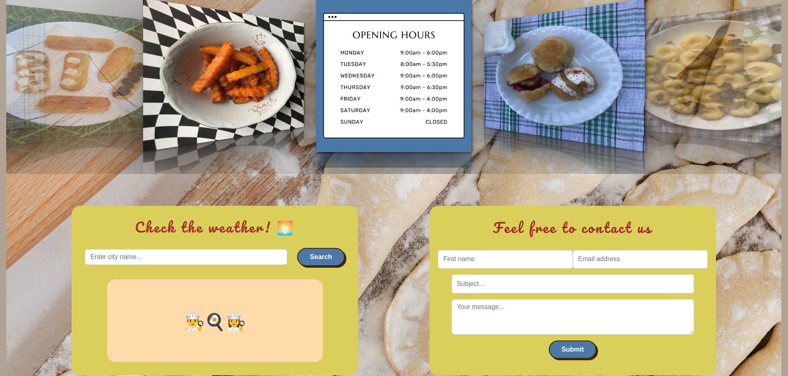
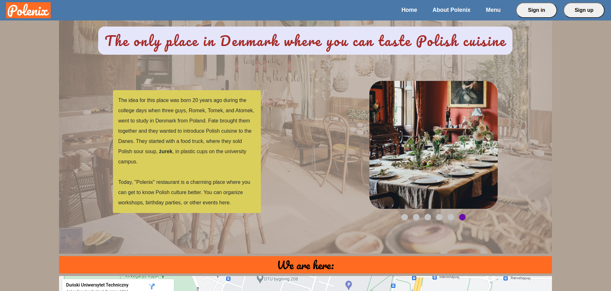
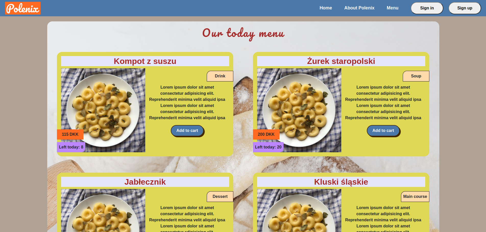

# "Polenix" - web application

This is a concept for single-page web application designed for a potential Polish restaurant in Copenhagen, developed using React.js and Node.js.

<a href="https://polenix-4ee0a.web.app/" target="_blank">Click here to open live demo</a>

## Table of Contents

- [General Info](/#general-information)
- [Technologies Used](#technologies-used)
- [Features](#features)
- [Screenshots](#screenshots)
- [Local Setup](#local-setup)
- [Project Status](#project-status)
- [Future Work](#future-work)

## General Information

<a name="general-information"></a>

- As an avid cook and enthusiast of Polish cuisine, I've collected several pictures of dishes, including many traditional Polish recipes, in my photo gallery. Combined with my love for Copenhagen, I decided to turn this into a web application, which resulted in the project you see here.

- The Polish community is the second-largest national minority in Denmark, and while there is a shop in Copenhagen selling Polish products that is doing very well, **there is no restaurant serving Polish food**. Given the potential target audience, opening and running such a restaurant sounds like a sensible business idea.

- The aim of the project is to provide a web application concept for a restaurant serving Polish cuisine in Copenhagen.

- The web application would be presented to anyone interested in opening such a restaurant and can serve as a real, ready-made product or as an inspiration for an actual one.

## Technologies Used

- Frontend
  - Languages and Frameworks
    - JavaScript
    - HTML
    - React.js
  - Forms
    - React Hook Form
    - Formik 
  - API Calls
    - GraphQL (Apollo)
  - Styling
    - Tailiwind CSS
    - CSS
    - Styled Components
    - Styled JSX
    - Bootstrap
  - Authentication Strategy
    - Jsonwebtoken
  - Deployment
    - Firebase
      
- Backend (go to the [backend repository](https://github.com/bart-ziolkowski/Polenix_server))
  - Languages and Frameworks
    - JavaScript
    - Node.js
    - Express.js
  - API Client
    - GraphQL (Apollo)
  - Authentication
    - Jsonwebtoken
  - Database and ORM
    - Sequelize
    - MySQL
  - Deployment
    - Heroku

## Features

- own design of application subpages
- weather widget
- contact form
- photo galleries in the form of a slideshow
- browsing the list of today's dishes
- ordering meals
- access to order history
- account creation
- login and logout
- validation of forms
- responsiveness

## Screenshots

|             |
| :------------------------------------------------------------: |
|                       _Top of Home Page_                       |
|             |
|                     _Bottom of Home Page_                      |
|                  |
|                        _About us Page_                         |
|  |
|                     _Restaurant Menu Page_                     |

## Local Setup

- You must have a MySQL database and Node.js installed on the device.
- You will find the dependencies for the frontend in this repository in the package.json file.
- In turn, you will find the dependencies for the backend in its repository respectively.

### How to run the project

1. Create a database in MySQL.
2. Create a folder called e.g. "Polenix" and navigate to it in the terminal.
3. Clone the frontend repository:

```
git clone https://github.com/bart-ziolkowski/Polenix_client.git
```

5. Install the frontend dependencies:

```
npm install
```

6. Create a .env file for frontend and add the following variables:

   - REACT_APP_SERVICE_ID
   - REACT_APP_TEMPLATE_ID
   - REACT_APP_USER_ID
   - REACT_APP_APOLLO_URL

7. Navigate to "Polenix" folder and clone the backend repository:

```
git clone https://github.com/bart-ziolkowski/Polenix_server.git
```

8. Install the backend dependencies:

```
npm install
```

9. Create a .env file for backend and add the following variables:

- DATABASE_URL
- PORT
- NODE_ENV
- REACT_APP_WEATHER_API_KEY
- JWT_SECRET

10. Navigate to the "Polenix_client" folder and run the frontend:

```
npm start
```

11. Navigate to the "Polenix_server" folder and run the backend:

```
npm start
```

## Project Status

In this moment, the project is in a finished phase, but there is still room for improvement.

## Future Work

- allow users with the role of "EMPLOYEE" to manage dishes and orders
- integrate app with CMS
- allow users with the role of "ADMIN" to manage users
